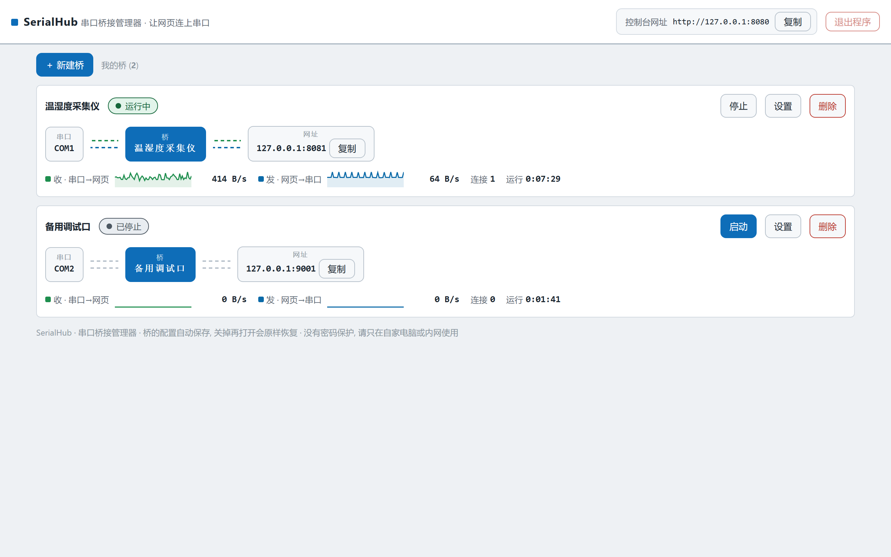
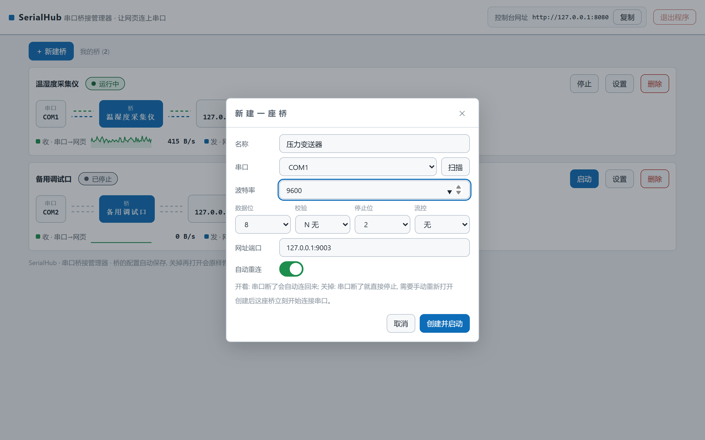
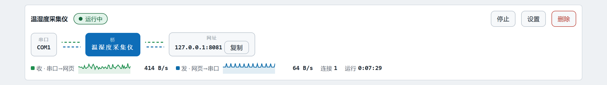
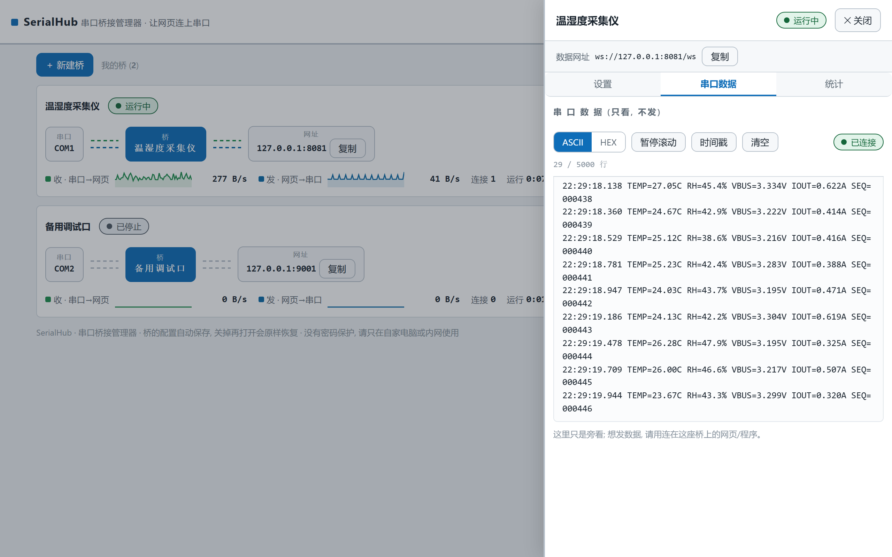
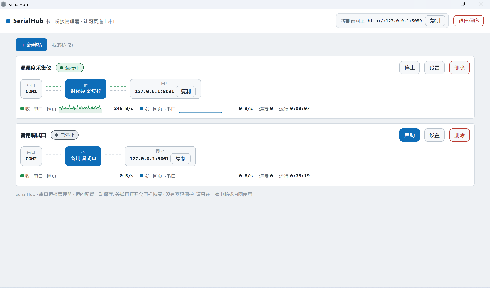
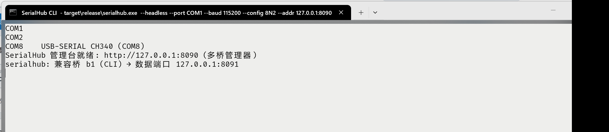

# SerialHub — 串口 ⇄ WebSocket 桥接管理器

一句话: 把串口设备变成一条 WebSocket 字节管道, 浏览器页面和脚本直接读写原始字节。

三行定位:

- **多桥管理台**: 固定管理网址, 建桥/启停/改配/删除全在网页里, 重启自动恢复;
- **原始字节双向**: WS 纯二进制帧, 多客户端广播, 掉线自动重连 (每桥可关);
- **单二进制**: 跨平台单文件, 内嵌 Web 控制台, 桌面客户端 + CLI 双形态。

## 特性

| 特性 | 说明 |
|---|---|
| 多桥管理台 | 同时运行多座桥; 新建/启动/停止/改配/删除; `fleet.json` 持久化, 进程重启自动恢复全部桥 |
| 可视化 | 每桥流程图 (串口 ⇄ 桥 ⇄ 网址, 有流量时点亮) + 四态徽章 + 速率火花线 + 收发字节/连接数/错误/时长 |
| 自动重连 | 串口拔出/重枚举按 1s 节奏自动重连, 重试次数实时可见, 恢复后客户端零动作续传; 每桥可独立开关 |
| 串口全参数 | 110~2,000,000 波特, 数据位 7/8, 校验 N/E/O, 停止位 1/2, 流控 none/rtscts/xonxoff |
| 桌面客户端 | 原生窗口 + 系统托盘 (关窗即退到后台); `--headless` 纯 CLI 模式供脚本与 CI |
| CLI ⇄ UI 对等 | 每个配置项两端都有; 控制台一键复制与当前配置等价的启动命令 |

## 快速开始

从 [Releases](../../releases) 下载对应平台的压缩包解压, 或源码安装:

```bash
cargo install --path .
```

三行命令上手 (旧单桥参数 = 自动建一座桥并启动):

```bash
serialhub --port COM1 --baud 115200 --config 8N2 --addr 127.0.0.1:8080
# 浏览器打开 http://127.0.0.1:8080 —— 管理台即用
# 程序接入: ws://127.0.0.1:8081/ws (本桥数据端点, 纯二进制)
```

桌面客户端双击即用 (默认 GUI: 原生窗口 + 托盘); 纯命令行场景加 `--headless`。

## 截图

| | |
|---|---|
|  |  |
|  |  |
|  |  |

## 程序接入

每座桥的数据端点为 `ws://<桥网址>/ws`, 只传**原始二进制帧** (10 进制字节), 无包帧协议。
两条语义务必知道:

- **WS 消息边界 ≠ 串口帧边界**: 设备一次写入可能被拆成多条消息, 多次写入可能被合并;
  页面侧协议栈自己容忍任意分块。
- **慢客户端丢旧帧**: 下行环形缓冲 1024 条, 消费跟不上时丢最旧帧保连接 (Lagged),
  不反压、不踢人 —— 高波特率下请确保消费端跟得上。

Python 示例 (`pip install websockets`):

```python
import asyncio, websockets

async def main():
    async with websockets.connect("ws://127.0.0.1:8081/ws") as ws:
        await ws.send(b"\x01\x03\x00\x00")   # 上行: 写入串口
        while True:
            data = await ws.recv()           # 下行: 串口收到的原始字节
            print(repr(data))

asyncio.run(main())
```

控制面走 `/api/*` (JSON), 与数据面彻底分离, 端点表见[用户手册 API 摘要](docs/manual/用户使用手册.md#八api-摘要)。

可直接跑的最小接入示例见 [`examples/`](examples/) (零依赖网页客户端 + Python 客户端),
配套五步教程见[用户手册「最小示例」](docs/manual/用户使用手册.md#最小示例-examples)。

## 文档

- [用户使用手册](docs/manual/用户使用手册.md) — 安装、五分钟上手、界面详解、命令行参考、程序接入、故障排查
- [API 摘要](docs/manual/用户使用手册.md#八api-摘要) — `/api/fleet` 系与 `/api/status` 端点表
- [更新日志](CHANGELOG.md)
- [产品规格](docs/product/spec.md) · [安全策略](SECURITY.md)

## 开发

```bash
cargo test                      # Rust 单元测试 (56 条)
python -m pytest tests/ -v      # 集成一致性套件 (COM1↔COM2 虚拟对, 40 条)
```

本项目由一个**多智能体团队**迭代 (架构师编排 → Dev 开发 → QA 测试 → UX 体验官, 反馈回流待办池);
人类贡献者走同样的回路, 见 [CONTRIBUTING.md](CONTRIBUTING.md) 与 [docs/team/](docs/team/)。

## 许可证

[Apache-2.0](LICENSE)。

## About (English)

SerialHub is a serial-port ⇄ WebSocket **bridge manager**. It exposes each serial
port as a WebSocket byte pipe: one fixed management URL hosts a built-in web
console where you create, start, stop and reconfigure any number of bridges;
each bridge gets its own stable `ws://…/ws` endpoint carrying raw binary frames
in both directions, broadcast to every connected client.

- **Multi-bridge dashboard** — flow diagram, state badges, throughput sparklines,
  connection counters; configuration persisted and restored across restarts.
- **Hands-free reconnect** — unplugged/renumerated ports are retried every second
  (per-bridge switch); clients keep their connection and resume without action.
- **Full serial parameters** — 110~2,000,000 baud, 7/8 data bits, N/E/O parity,
  1/2 stop bits, none/rtscts/xonxoff flow control; CLI and UI fully equivalent.
- **Desktop client or headless** — native window with tray (close-to-tray), or
  `--headless` for scripts and CI.

Grab a prebuilt binary from [Releases](../../releases) or run
`cargo install --path .`, then open `http://127.0.0.1:8080`. Docs are in
Chinese; see the [user manual](docs/manual/用户使用手册.md) and
[CHANGELOG](CHANGELOG.md). Licensed under [Apache-2.0](LICENSE).
